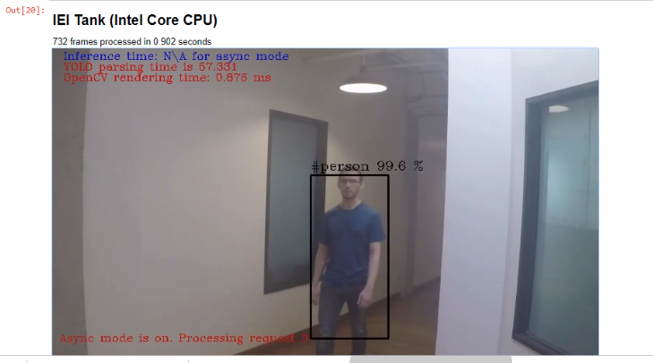
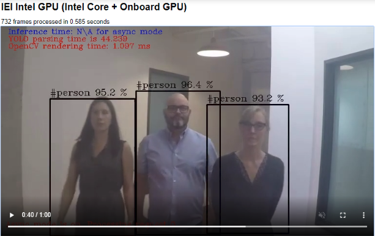
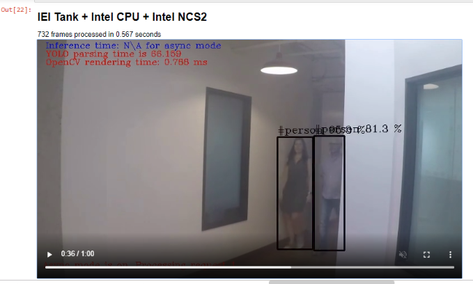
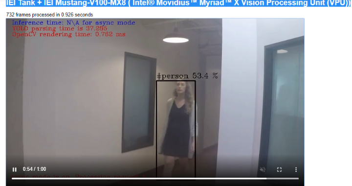
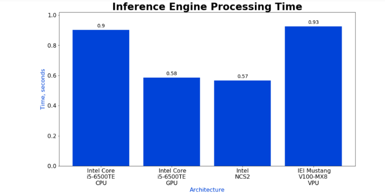
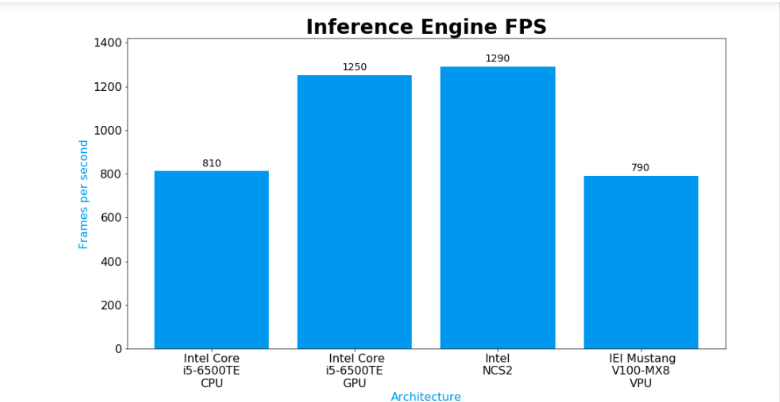

# Object Detection YOLO* V3 Python* Demo on DevCloud

To Validate the Object Detection Demo Yolo V3 Async On Devcloud, proceed with below steps.

## Log in to the Intel® DevCloud:
- Sign into the Intel DevCloud account with your credentials from [here](https://software.intel.com/en-us/devcloud/edge)
- If you are new user, Register into the Intel DevCloud account from [here](https://software.intel.com/registration/?lang=en-us)
- In home page, Under "Advanced Tab", Click on "Connect and Create"
- Click on My Files, then you will be navigated to your Home Directory.

## Install prerequisities on DevCloud:
- Install Tensorflow 1.12 version and pillow.
- Click on New Button in Home Directory and then select Terminal Option to open a new terminal.
- Run the following commands in terminal to install packages.

``` bash
    $ pip3 install tensorflow==1.12
    $ pip3 install pillow
```
## Create a Directory in Home Folder on DevCloud:

- Click on New Button in Home Directory and then select the Folder Option to create a directory and rename it as Benchmarking_DL_Models directory
- Inside Benchmarking_DL_Models directory, create another directory and rename it as Yolo_V3_Model directory.

## Download the  Object Detection Yolo V3 Jupyter Notebook and Python File From GitHub Repository:

- Download the object_detection_demo_yolov3_async.ipynb file and upload it in "$HOME/Benchmarking_DL_Models/Yolo_V3_Model" directory on DevCloud using "Upload" option in your Home Directory.
- Download the updated object_detection_demo_yolov3_async.py and upload it in "$HOME/Benchmarking_DL_Models/Yolo_V3_Model" directory on DevCloud using "Upload" option.

## Steps to run the Object Detection Yolo V3 Jupyter Notebook File on DevCloud:

- Navigate to $HOME/Benchmarking_DL_Models/Yolo_V3_Model directory and Open object_detection_demo_yolov3_async.ipynb file.
- Run the following cells.

## Step 0: Set Up
### 0.1: Import Dependencies

- Execute the following command to import Python dependencies needed for displaying the results in this notebook.(Select the cell and use Ctrl+Enter to execute the cell)

```
  from IPython.display import HTML
  import matplotlib.pyplot as plt
  import os
  import time
  import sys
  from pathlib import Path
  sys.path.insert(0, str(Path().resolve().parent.parent))
  sys.path.insert(0,os.path.join(os.environ['HOME'],'Reference-samples/iot-devcloud/demoTools/'))
  from demoutils import *
  from openvino.inference_engine import IEPlugin, IENetwork
  import cv2
```
### Source your Environment Variables  

- Run the following command

```bash
   !/opt/intel/openvino/bin/setupvars.sh
```

### Build the OpenVINO Samples

- Execute the following command to build the OpenVINO Samples

```bash
   !/opt/intel/openvino/deployment_tools/inference_engine/samples/build_samples.sh
```

## Step 1: Converting YOLO* Models to the Intermediate Representation (IR) using Model Optimizer.

In this section, you will use the Model Optimizer to convert a trained model to two Intermediate Representation (IR) files (one .bin and one .xml). The Inference Engine requires this model conversion so that it can use the IR as input and achieve optimum performance on Intel hardware.

#### Run the following commands to Dump YOLOv3 TensorFlow* Model

#### 1.1  Clone the Repository

```bash
   !git clone https://github.com/mystic123/tensorflow-yolo-v3.git
```

#### 1.2 (Optional) Checkout to the commit that the conversion was tested on:

```bash
    !cd tensorflow-yolo-v3 && git checkout ed60b90
```

#### 1.3 Download the yolov3.weights (for the YOLOv3 model)

```bash
    !wget https://pjreddie.com/media/files/yolov3.weights -P $HOME/Benchmarking_DL_Models/Yolo_V3_Model/tensorflow-yolo-v3/
```

#### 1.4 Download coco.names file from the DarkNet website OR use labels that fit your task

```bash
    !wget https://raw.githubusercontent.com/pjreddie/darknet/master/data/coco.names -P $HOME/Benchmarking_DL_Models/Yolo_V3_Model/tensorflow-yolo-v3/
```

#### 1.5 Run the following command to generate .pb File

```bash
    !python3 tensorflow-yolo-v3/convert_weights_pb.py --class_names tensorflow-yolo-v3/coco.names --data_format NHWC --weights_file tensorflow-yolo-v3/yolov3.weights
```

#### 1.6 Run the following command to generate .xml and .bin files

```bash
    !mkdir FP32,FP16

    !python3 /opt/intel/openvino/deployment_tools/model_optimizer/mo_tf.py --input_model=$HOME/Benchmarking_DL_Models/Yolo_V3_Model/frozen_darknet_yolov3_model.pb --tensorflow_use_custom_operations_config /opt/intel/openvino/deployment_tools/model_optimizer/extensions/front/tf/yolo_v3.json --batch 1 -o FP32/

    !python3 /opt/intel/openvino/deployment_tools/model_optimizer/mo_tf.py --input_model=$HOME/Benchmarking_DL_Models/Yolo_V3_Model/frozen_darknet_yolov3_model.pb --tensorflow_use_custom_operations_config /opt/intel/openvino/deployment_tools/model_optimizer/extensions/front/tf/yolo_v3.json --batch 1 --data_type=FP16 -o FP16/
```

### Input Video

Run the following command to get the input video from the Reference samples directory

```bash
    !cp $HOME/Reference-samples/iot-devcloud/cpp/interactive_face_detection_demo/faces-recognition-walking.mp4 $HOME/Benchmarking_DL_Models/Yolo_V3_Model/
```

Execute the following command to create a symlink and view the input video.

```bash
    !ln -sf $HOME/Benchmarking_DL_Models/Yolo_V3_Model/
    videoHTML('Input Video', ['faces-recognition-walking.mp4'])
```

## Step 2: Inference on a video

The Python code takes in command line arguments for video, model and so on.

**Command line arguments options and how they are interpreted in the application source code**

```
python3 object_detection_demo_yolov3_async.py  -m ${MODELPATH} \
                                               -i ${INPUT_FILE} \
                                               -o ${RESULTS_PATH} \
                                               -d ${DEVICE} \
                                               --labels ${LABEL_FILE} \
                                               -l /opt/intel/openvino/deployment_tools/inference_engine/lib/intel64/libcpu_extension_sse4.so
```

### 2.1: Create a Job File

All the code up to this point has been executed within the Jupyter Notebook instance running on a development node based on an Intel® Xeon® Scalable Processor, where the Notebook is allocated to a single core. To run inference on the entire video, you need more compute power. Run the workload on several DevCloud's edge compute nodes and then send work to the edge compute nodes by submitting jobs into a queue. For each job, specify the type of the edge compute server that must be allocated for the job.

To pass the specific variables to the Python code, we use the following arguments:

* `-m`       &nbsp;&nbsp;&nbsp;&nbsp;&nbsp;&nbsp;location of the optimized **YOLO V3** model's XML
* `-i`       &nbsp;&nbsp;&nbsp;&nbsp;&nbsp;&nbsp;location of the input video
* `-o`       &nbsp;&nbsp;&nbsp;&nbsp;&nbsp;&nbsp;output directory
* `-d`       &nbsp;&nbsp;&nbsp;&nbsp;&nbsp;&nbsp;hardware device type (CPU, GPU, MYRIAD)
* `-l`       &nbsp;&nbsp;&nbsp;&nbsp;&nbsp;&nbsp;path to the CPU extension library
* `--labels` &nbsp;&nbsp;&nbsp;&nbsp;Labels mapping File

The job file will be executed directly on the edge compute node.

- Run the following command to write the Job File

```bash
%%writefile obj_det_yolo_job.sh
ME=`basename $0`

# The default path for the job is your home directory, so we change directory to where the files are.
cd $PBS_O_WORKDIR
DEVICE=$2
FP_MODEL=$3
INPUT_FILE=$4
RESULTS_BASE=$1


MODELPATH="$HOME/Benchmarking_DL_Models/Yolo_V3_Model/${FP_MODEL}/frozen_darknet_yolov3_model.xml"
RESULTS_PATH="${RESULTS_BASE}"
mkdir -p $RESULTS_PATH
echo "$ME is using results path $RESULTS_PATH"

if [ "$DEVICE" = "HETERO:FPGA,CPU" ]; then
    # Environment variables and compilation for edge compute nodes with FPGAs
    export LD_LIBRARY_PATH=${LD_LIBRARY_PATH}:/opt/altera/aocl-pro-rte/aclrte-linux64/
    # Environment variables and compilation for edge compute nodes with FPGAs
    source /opt/fpga_support_files/setup_env.sh
    aocl program acl0 /opt/intel/openvino/bitstreams/a10_vision_design_bitstreams/2019R1_PL1_FP11_MobileNet_Clamp.aocx
fi

# Running the object detection code
! python3 object_detection_demo_yolov3_async.py  -m ${MODELPATH} \
                                                 -i $INPUT_FILE \
                                                 -o $RESULTS_PATH \
                                                 -d $DEVICE \
                                                 --labels tensorflow-yolo-v3/coco.names \
                                                 -l /opt/intel/openvino/deployment_tools/inference_engine/lib/intel64/libcpu_extension_avx2.so
```
### 2.2: Understand how jobs are submitted into the queue

Now that we have the job script, we can submit the jobs to edge compute nodes. In the IoT DevCloud, you can do this using the `qsub` command.
We can submit people_counter to several different types of edge compute nodes simultaneously or just one node at a time.

There are three options of `qsub` command that we use for this:
- `-l` : this option let us select the number and the type of nodes using `nodes={node_count}:{property}`.
- `-F` : this option let us send arguments to the bash script.
- `-N` : this option let us name the job so that it is easier to distinguish between them.

The `-F` flag is used to pass arguments to the job script.
The [obj_det_yolo_job.sh](obj_det_yolo_job.sh) takes in 4 arguments:
1. the path to the directory for the output video and performance stats
2. targeted device (e.g. CPU, GPU and MYRIAD.
3. the floating precision to use for inference
4. location of the input video stream

The job scheduler uses the contents of `-F` flag as the argument to the job script.

If you are curious to see the available types of nodes on the IoT DevCloud, run the following optional cell.

```bash
    !pbsnodes | grep compnode | awk '{print $3}' | sort | uniq -c
```

Here, the properties describe the node, and number on the left is the number of available nodes of that architecture.

**Note**: If you want to use your own video, change the environment variable 'VIDEO' in the following cell from "input_video.mp4" to the full path of your uploaded video.

- Run the following command

```bash
    os.environ["VIDEO"] = 'faces-recognition-walking.mp4'
```
### 2.3: Job queue submission

Each of the cells below will submit a job to different edge compute nodes.
The output of the cell is the `JobID` of your job, which you can use to track progress of a job.

**Note** You can submit all jobs at once or follow one at a time.

After submission, they will go into a queue and run as soon as the requested compute resources become available.
(tip: **shift+enter** will run the cell and automatically move you to the next cell. So you can hit **shift+enter** multiple times to quickly run multiple cells)

#### Submitting to an edge compute node with an Intel® CPU
In the cell below, submit a job to <a
    href="https://software.intel.com/en-us/iot/hardware/iei-tank-dev-kit-core">IEI
    Tank* 870-Q170</a> edge node with an <a
    href="https://ark.intel.com/products/88186/Intel-Core-i5-6500TE-Processor-6M-Cache-up-to-3-30-GHz-">Intel® Core™ i5-6500TE processor</a>. The inference workload will run on the CPU.

- Run the following command to submit job to the queue

```
    #Submit job to the queue
    job_id_core = !qsub obj_det_yolo_job.sh -l nodes=1:idc001skl:i5-6500te -F "results/Core CPU FP32 $VIDEO " -N obj_det_core
    print(job_id_core[0])
    #Progress indicator
    if job_id_core:
        progressIndicator('results/Core', 'i_progress.txt', "Inference", 0, 100)
```

#### Submitting to an edge compute node with Intel® Core CPU and using the onboard Intel® GPU
In the following cell, we submit a job to <a
    href="https://software.intel.com/en-us/iot/hardware/iei-tank-dev-kit-core">IEI
    Tank* 870-Q170</a> edge node with an <a href="https://ark.intel.com/products/88186/Intel-Core-i5-6500TE-Processor-6M-Cache-up-to-3-30-GHz-">Intel® Core i5-6500TE</a>. The inference workload will run on the Intel® HD Graphics 530 card integrated with the CPU.

- Run the following command to submit job to the queue

```
#Submit job to the queue
job_id_gpu = !qsub obj_det_yolo_job.sh -l nodes=1:idc001skl:intel-hd-530 -F " results/GPU GPU FP32 $VIDEO" -N obj_det_gpu
print(job_id_gpu[0])
#Progress indicator
if job_id_gpu:
    progressIndicator('results/GPU', 'i_progress.txt', "Inference", 0, 100)
```

#### Submitting to an edge compute node with Intel® NCS 2 (Neural Compute Stick 2)
In the following cell, we submit a job to <a
    href="https://software.intel.com/en-us/iot/hardware/iei-tank-dev-kit-core">IEI
    Tank 870-Q170</a> edge node with an <a href="https://ark.intel.com/products/88186/Intel-Core-i5-6500TE-Processor-6M-Cache-up-to-3-30-GHz-">Intel Core i5-6500te CPU</a>. The inference workload will run on an <a
    href="https://software.intel.com/en-us/neural-compute-stick">Intel Neural Compute Stick 2</a> installed in this  node.

- Run the following command to submit job to the queue

```
#Submit job to the queue
job_id_ncs2 = !qsub obj_det_yolo_job.sh -l nodes=1:idc004nc2:intel-ncs2 -F "results/NCS2 MYRIAD FP16 $VIDEO " -N obj_det_ncs2
print(job_id_ncs2[0])
#Progress indicator
if job_id_ncs2:
    progressIndicator('results/NCS2', 'i_progress.txt', "Inference", 0, 100)
```

#### Submitting to an edge compute node with IEI Mustang-V100-MX8 ( Intel® Movidius™ Myriad™ X Vision Processing Unit (VPU))
In the cell below, we submit a job to an IEI Tank 870-Q170 edge node with an Intel Core i5-6500te CPU. The inference workload will run on an IEI Mustang-V100-MX8 accelerator installed in this node.

- Run the following command to submit job to the queue

```
#Submit job to the queue
job_id_hddlr = !qsub obj_det_yolo_job.sh -l nodes=1:idc002mx8:iei-mustang-v100-mx8 -F "results/HDDL HDDL FP16 $VIDEO" -N obj_det_hddlr
print(job_id_hddlr[0])
#Progress indicator
if job_id_hddlr:
    progressIndicator('results/HDDL', 'i_progress.txt', "Inference", 0, 100)
```
### 2.4 Check the Progress

Check the progress of the jobs. `Q` status stands for `queued`, `R` for `running`. How long a job is being queued is dependent on number of the users. It should take up to 5 minutes for a job to run. If the job is no longer listed, it's done.

- Run the following command to see the jobs you have submitted.

```bash
   liveQstat()
```

You should see the jobs you have submitted (referenced by `Job ID` that gets displayed right after you submit the job in step 3.3).
There should also be an extra job in the queue "jupyterhub": this job runs your current Jupyter Notebook session.

The 'S' column shows the current status.
- If it is in Q state, it is in the queue waiting for available resources.
- If it is in R state, it is running.
- If the job is no longer listed, it means it is completed.

**Note**: Time spent in the queue depends on the number of users accessing the edge nodes. Once these jobs begin to run, they should take from 1 to 5 minutes to complete.


## Step 3: Expected Results

#### IEI Tank (Intel Core CPU)

- Run the following command to view the results

```bash
videoHTML('IEI Tank (Intel Core CPU)',
          ['results/Core/output.mp4'],
          'results/Core/stats.txt')
```
#### Expected Output:




#### IEI Intel GPU (Intel Core + Onboard GPU)

- Run the following command to view the results

```bash
videoHTML('IEI Intel GPU (Intel Core + Onboard GPU)',
          ['results/GPU/output.mp4'],
          'results/GPU/stats.txt')
```
#### Expected Output:



#### IEI Tank + Intel CPU + Intel NCS2

- Run the following command to view the results

```bash
videoHTML('IEI Tank + Intel CPU + Intel NCS2',
           ['results/NCS2/output.mp4'],
          'results/NCS2/stats.txt')
```

#### Expected Output:



#### IEI Tank + IEI Mustang-V100-MX8 ( Intel® Movidius™ Myriad™ X Vision Processing Unit (VPU))

- Run the following command to view the results

```bash
 videoHTML('IEI Tank + IEI Mustang-V100-MX8 ( Intel® Movidius™ Myriad™ X Vision Processing Unit (VPU))',
          ['results/HDDL/output.mp4'],
         'results/HDDL/stats.txt')
```

#### Expected Output:



## Step 4: Performance Comparison

The running time of each inference task is recorded in `stats.txt` in `results` folder, where the *architecture* corresponds to the architecture of the target edge compute node. Run the cell below to plot the results of all jobs side-by-side. Lower values for processing time mean better performance. Some architectures are optimized for the highest performance, others for low power or other metrics.

- Run the following command to view the Performance Comparison

```
arch_list = [('core', 'Core', 'Intel Core\ni5-6500TE\nCPU'),
             ('gpu', 'GPU', ' Intel Core\ni5-6500TE\nGPU'),
             ('ncs2', 'NCS2', 'Intel\nNCS2'),
             ('hddlr','HDDL', ' IEI Mustang\nV100-MX8\nVPU')]

stats_list = []
for arch, dir_,  a_name in arch_list:
    if 'job_id_'+arch in vars():
        stats_list.append(('results/{}/stats.txt'.format(dir_), a_name))
    else:
        stats_list.append(('placeholder'+arch, a_name))

summaryPlot(stats_list, 'Architecture', 'Time, seconds', 'Inference Engine Processing Time', 'time' )
summaryPlot(stats_list, 'Architecture', 'Frames per second', 'Inference Engine FPS', 'fps' )

```
#### Expected Result :



